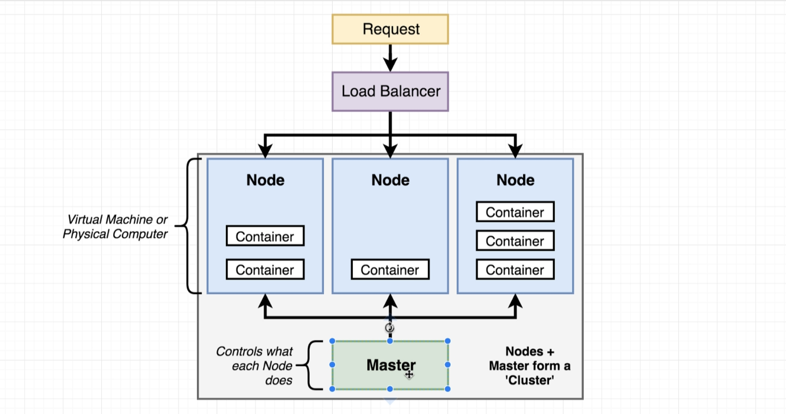

# section 12 

## what is kubernetes
- system for running many different containers over multiple different machines
- system to deploy containerized apps
- spins up a cluster
- cluster is made of nodes + master
- master controls what each node does
- each node is a VM that runs containers
- requires manual network setup
- expects each docker image to be pre-built
  - in other words, kubernetes does not offer a service to build docker images
- k8s does not build our images it gets them from somewhere else
- 

## why would we want to use it
- it is discouraged to use kubernetes with a project that has a single container
- when you need to run many different containers in different nodes
- when we want to scale out individual containers to serve higher traffic loads

### kubernetes dev vs prod
- in development we use minikube / dockerdesktop to spin up k8 cluster in our machine
  - kubectl manages containers in the node
  - minikube / docker desktop for managing a kube vm
- in production we use a managed solution to spin up and manage k8 clusters
  - on aws, eks
  - on gcp, gke

### kubernetes installed with wsl2
- enabling wsl can be a pain - following this articles solution fixed the problem for me - https://forums.docker.com/t/docker-wont-start-checking-if-isocache-exists-createfile-wsl-docker-desktop-data-isocache-the-network-name-cannot-be-found-n-n/134556/3

### kubernetes master
- machines (or vms) with a set of programs to manage nodes
- takes instructions from user and applies changes to the cluster
- updates nodes following the specified rules
- decides where to run each container - each node can run a dissimilar set of containers
- to deploy something, we update the desired state of the master with a config file
- constantly works to meet the desired state

### kubernetes object
- serve different purposes - running a container, monitoring a container, setting up networking, etc
- can create different kinds of objects
  - statefulSet
  - ReplicaController
  - Pod - used to run a container
  - Service - can set up networking rules
- kind in config files determines the type of k8 object that will be created
- each API version determines the different set of objects available

#### k8 nodes
- individual machines (or vms) that run containers

#### k8 masters

#### k8 pod
- a pod runs in a k8 node (vm running in k8s)
- can run one or more containers inside a pod
- used to run containers with a very similar purpose
  - discouraged to use a single pod for multiple (dependent) applications

#### k8 service
- sets up networking in a Kubernetes Cluster
- has several subtypes:
  - clusterIp
  - nodePort - exposes a container to the outside world (only good for dev purposes)
  - loadBalancer
  - ingress

##### k8 service - nodeport
- connects the k8 proxy (where requests come in) to pods
- selects specific components through the use of labels

### kubernetes commands
- kubctl apply -f client-pod.yaml
  - adds the specified object to the k8 cluster
- kubctl get pods (object)
  - lists available objects

### kubernetes deployment
- centrally managed by the master node
- master node tells what containers should be running
- distributes containers on available nodes
- we (developers) send commands to the master node, which then updates nodes accordingly

#### k8 imperative deployments
- not recommended to take an imperative approach with k8s!
- do exactly these steps to arrive at this container setup
- exact steps need to be passed to the master
- should have a detailed migration plan
- requires more manual effort, such as:
  - checking current container state before deploying new containers
  - constantly checking container state and updating cluster

#### k8s declerative deployments
- recommended to run a declarative approach with k8s
- our container setup should look like this, make it happen
- sets guidance to the master, master itself takes care of fulfilling the declared rules
- example use case, with version updates:
  - update config file
  - deploy config file to k8s
  - master updates all nodes & containers with new config file
  - master destroys all nodes and containers with old config file

## Legacy

### Kubernetes basics graphs

#### Kubernetes Overview

#### Kubernetes Dev vs Prod

#### Kubernetes Dev overview
